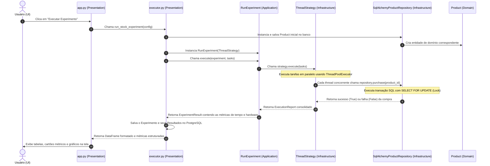
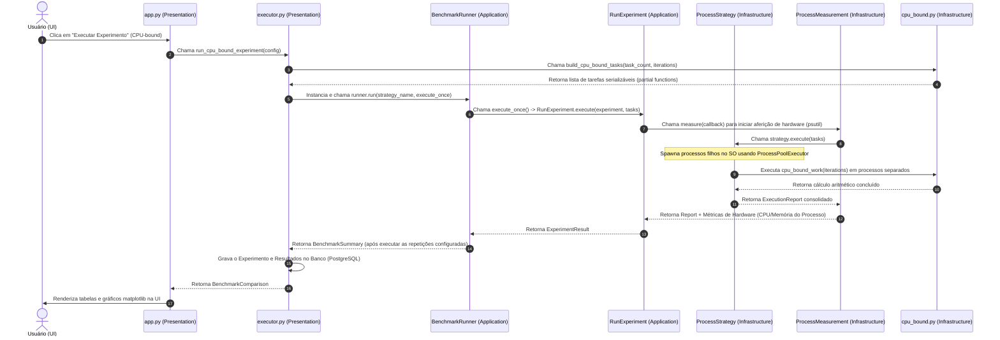
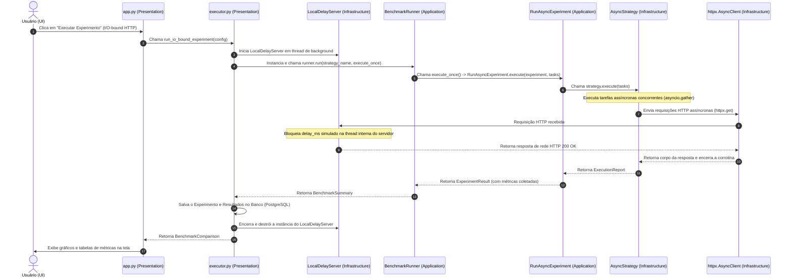
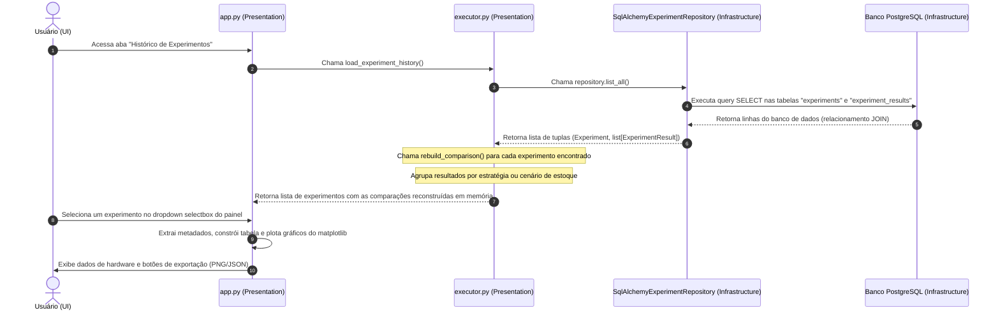

# Guia de Diagramas de Sequência e Fluxos do Sistema

Este documento descreve detalhadamente os fluxos de execução do laboratório concorrente, divididos por workloads e cenários reais. A arquitetura segue os princípios da Clean Architecture, onde o fluxo de controle inicia na camada de **Apresentação**, passa pelos **Casos de Uso (Aplicação)**, é executado e monitorado nas **Estratégias Concorrentes (Infraestrutura)** e é persistido através de **Repositórios (Infraestrutura)** no banco relacional PostgreSQL, mantendo isoladas as regras das **Entidades (Domínio)**.

---

## 1. Fluxo de Estoque (Escrita Concorrente e Transação de Banco)

Este cenário demonstra a disputa de múltiplos clientes simultâneos tentando realizar a compra de um produto em estoque compartilhado. É usado para comparar o comportamento de condições de corrida (Race Conditions) e a eficácia de locks (exclusão mútua em memória vs. lock de linha no banco de dados).

### Explicação Passo a Passo:
1.  **Entrada do Usuário (1-2)**: O usuário escolhe o número de threads (workers), estoque inicial e tentativas de compra, e clica em disparar a execução.
2.  **Preparação do Cenário (3-4)**: O `executor.py` inicializa o produto no PostgreSQL usando o repositório, garantindo que o saldo seja redefinido para o valor do estoque inicial configurado.
3.  **Encaminhamento (5-6)**: O caso de uso `RunExperiment` recebe a lista de tarefas gerada (onde cada tarefa é uma chamada à função de compra) e a repassa para a estratégia concorrente multithreading.
4.  **Disputa Concorrente (7-10)**: O `ThreadStrategy` cria um `ThreadPoolExecutor` que despacha as threads. Cada thread entra no repositório de forma concorrente:
    *   No modo *com lock*: A instrução `SELECT ... FOR UPDATE` do Postgres bloqueia a linha de dados do produto. As demais transações aguardam sequencialmente a liberação da linha (via `COMMIT` ou `ROLLBACK`), impedindo que o estoque fique negativo ou inconsistente.
    *   No modo *sem lock*: A query é executada com um comando `SELECT` simples, sem bloqueio de linha. O interpretador lê o saldo desatualizado e introduz um pequeno delay (tempo de interleave) antes da gravação, induzindo a ocorrência de condições de corrida, gerando estoque final negativo e vendas duplicadas/inconsistentes.
5.  **Coleta e Armazenamento (11-13)**: Os resultados das compras são compilados no objeto de domínio `ExperimentResult`. O experimento e os tempos de execução de cada cenário de estoque são salvos no banco de dados.
6.  **Exibição (14-15)**: A tabela comparativa de inconsistências e throughput é renderizada na tela do Streamlit.

---

## 2. Fluxo CPU-Bound (Cálculo Multiprocesso)

Cálculos matemáticos pesados em Python puro são travados pelo GIL em ambientes multithread. Este cenário demonstra o uso do padrão de execução paralela utilizando múltiplos processos do sistema operacional para contornar o GIL e explorar o poder de processamento de múltiplos núcleos físicos.

### Explicação Passo a Passo:
1.  **Construção de Carga de Trabalho (1-4)**: A interface coleta a quantidade de cálculos (iterações) e chamadas e solicita as tarefas matemáticas. O arquivo `cpu_bound.py` constrói chamadas do tipo `functools.partial` para tornar as tarefas serializáveis via `pickle`, o que é exigido pela comunicação interprocessos do Python.
2.  **Repetições de Teste (5-6)**: O `BenchmarkRunner` orquestra a execução repetida das tarefas para garantir significância estatística, descartando a primeira execução como aquecimento (*warmup*).
3.  **Monitoramento (7-8)**: O caso de uso aciona o `ProcessMeasurement` que captura o tempo de CPU e uso de memória RAM inicial do processo pai (`psutil`).
4.  **Paralelismo Real (9-11)**: A `ProcessStrategy` cria o `ProcessPoolExecutor`. O Windows/Linux spawna novos processos filhos e distribui as tarefas pesadas entre os núcleos físicos de processador disponíveis da CPU. Cada subprocesso opera sob seu próprio interpretador com seu próprio GIL independente, computando somas modulares em paralelo.
5.  **Cálculo de Consumo (12-14)**: Ao término, o `ProcessMeasurement` captura o estado final do processo, calculando o uso médio de CPU normalizado entre 0% e 100% (ajustado de acordo com a quantidade de núcleos da máquina) e o consumo máximo de memória RAM.
6.  **Persistência (15-17)**: As médias e desvios padrão são consolidados, o histórico é gravado nas tabelas relacionais do banco e os gráficos finais são desenhados na tela do usuário.

---

## 3. Fluxo I/O-Bound HTTP (Programação Assíncrona e Event Loop)

Diferente do processamento de CPU, a comunicação de rede é limitada pela latência do servidor. Este cenário demonstra o poder da concorrência cooperativa em thread única (`asyncio`) comparada com a concorrência preemptiva por threads do SO.

### Explicação Passo a Passo:
1.  **Servidor de Latência Controlada (3)**: O `executor.py` inicializa um servidor local (`LocalDelayServer`) rodando em uma thread separada em background. Esse servidor expõe a rota `/delay?ms=XXX` para simular requisições lentas de forma determinística e reproduzível, sem depender de conexão externa com a internet.
2.  **Disparo das Corrotinas (4-7)**: A `AsyncStrategy` recebe as tarefas na forma de funções parciais de corrotina e as executa utilizando `asyncio.gather`. 
3.  **Concorrência Cooperativa (8-11)**: O interpretador do Python gerencia todas as requisições em uma única thread principal (Event Loop):
    *   A tarefa 1 dispara a requisição através do `httpx.AsyncClient` e cede o controle do interpretador (`await`).
    *   O Event Loop imediatamente passa a execução para a tarefa 2, disparando outra requisição, e assim por diante.
    *   Enquanto o servidor local está aguardando no seu respectivo `sleep()`, as conexões HTTP permanecem em progresso concorrente e sem bloquear o processamento local.
4.  **Encerramento (12-16)**: Ao receber todas as respostas de rede, as corrotinas são concluídas, o servidor local é finalizado de forma limpa, as métricas são agregadas e persistidas no PostgreSQL e os dados são exibidos na tela.

---

## 4. Fluxo de Histórico (Carregamento e Reconstrução de Comparações)

A visualização do histórico de testes evita a necessidade de reexecutar benchmarks pesados de rede ou CPU repetidamente a cada inicialização da aplicação. Este fluxo detalha a leitura do banco relacional e a modelagem dinâmica do relatório.

### Explicação Passo a Passo:
1.  **Carregamento de Dados (1-5)**: Ao acessar a aba de histórico, o Streamlit solicita todas as execuções antigas. O repositório executa queries `SELECT` de ordenação decrescente na tabela `experiments`, realizando a leitura de todas as métricas agregadas armazenadas na tabela `experiment_results`.
2.  **Reconstrução de Modelos (6-7)**: No `executor.py`, a função `rebuild_comparison` mapeia as estratégias gravadas no banco (incluindo cenários específicos de estoque como *"PostgreSQL sem Lock"*) de volta para coleções do tipo `BenchmarkSummary`, calculando os fatores de speedup relativos com base no baseline salvo e restaurando o mapeamento de estoque final (`stocks_map`).
3.  **Seleção do Usuário (8-10)**: O usuário escolhe o registro desejado na caixa de seleção (`selectbox`). O Streamlit recupera os dados correspondentes e reconstrói as tabelas comparativas, métricas e o painel de subplots do Matplotlib sem precisar executar nenhuma thread ou cálculo de CPU adicional.
